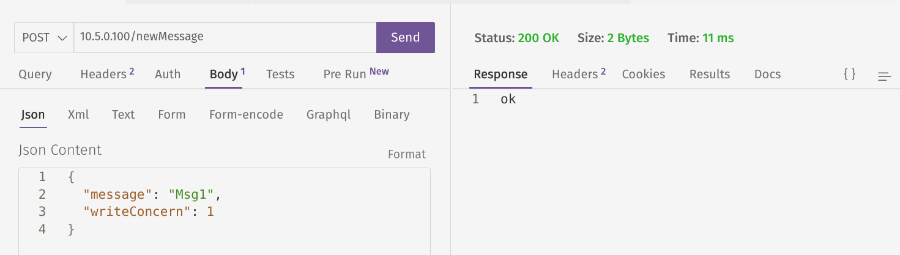
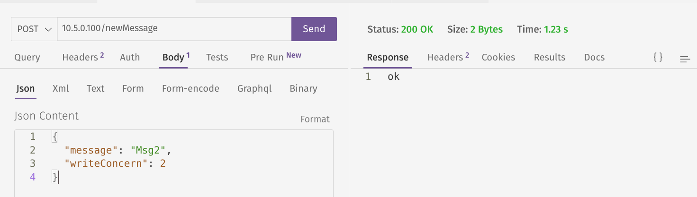
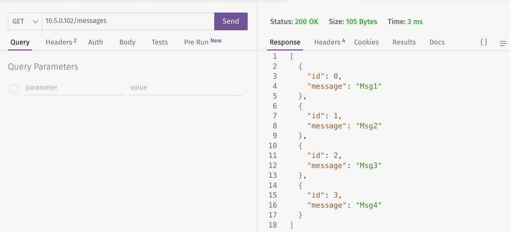

# DistributedSystemsHW

## Problem Description

This repo contains an implementation of ```replicated log with write concern``` task. It is stated as follows:
* there is one master node and arbitrary number of secondary nodes
* master node has an API to add a message
* each message that is added to master node is replicated across all secondary nodes
* you can specify a write concern ```N``` for each message. If you do that, the request will not return until there are ```N - 1``` confirmations from secondary nodes (confirmation from master node itself is also needed)
* both master and secondary nodes has an API for retrieving the list of messages. Messages should be displayed until the first "gap" (e.g. if for some reason older message arrived first, it should not be displayed in the output until all the previous messages have arrived)

While looking easy, the task has a few tricky aspects:
* master should recieve acknowledge from secondary when replicating the message. If the secondary hasn't acknowledged the message, it should be resent (which might lead to duplication and order inconsistency, both of which should be properly handled)
* secondary node should query the missed messages from master node when reconnecting
* the system should be resistant to any secondary node failure/disconnect (master node is considered to be online all the time)

## Docker Compose

```docker compose up``` launches the following containers:
* ```master``` (ip ```10.5.0.100```)
* ```bonnie``` (secondary 1, ip ```10.5.0.101```)
* ```clyde_``` (secondary 2, ip ```10.5.0.102```)

## API

### Master Node

* ```GET /messages```
* ```POST /newMessage``` with the following json body: ```{"message": "string", "writeConcern": unsigned int}```

### Secondary Node

* ```GET /messages```

## Implementation Details

* communication with secondary node happens via tcp socket (there is a single tcp connection associated with a partcular secondary where all the communication takes place)
* when sth is written through socket, a random delay between ```1000ms``` and ```2000ms``` is introduced (this is done to model inconsistencies, network delay and high load of the nodes). Note that response from the socket is considered timed out if there is no answer within ```1500ms```, so some requests will be resent (probably multiple times)
* secondary tries to reconnect to master if the connection is dropped
* when secondary connects to master, it queries the messages. After the messages have been recieved, secondary sends a ```SecondaryNodeReady``` request to master, which informs the master that this particular secondary has become operational

* libraries used: ```boost::asio```, ```boost::thread```

## Thread Model

### Master Node
* thread pool for secondary nodes internal communication (ideally 1 thread per socket)
* thread pool for http requests
* 1 thread for managing secondaries connect/disconnect

### Secondary Node
* 1 thread for communication with master internal communication
* thread pool for http requests

## CLI

```
>>> master-node --help
Options:
  -h [ --help ]           produce help message
  --name arg              friendly name of the node
  --http-port arg         http port
  --comm-port arg         internal communication port
  --http-workers arg (=3) number of http threads to use
  --comm-workers arg (=3) number of internal communication threads to use

>>> secondary-node --help
Options:
  -h [ --help ]           produce help message
  --name arg (=secondary) friendly name of the node
  --http-port arg         http port
  --http-workers arg (=3) number of http threads to use
  --master-ip arg         ip of the master node
  --master-comm-port arg  master internal communication port
```

## Example Usage (docker compose up)

```
clyde_  | [   0.000s] [clyde_,8cb00] [                      main.cpp:87  ]                                    [Info] : Master internal communication, ip=10.5.0.100, port=6000
clyde_  | [   0.000s] [clyde_,8cb00] [             secondarynode.cpp:51  ][SecondaryNode]                     [Info] : reconnecting to master node
clyde_  | [   0.000s] [clyde_,8cb00] [                      main.cpp:96  ]                                    [Info] : Using 3 http threads
clyde_  | [   0.000s] [clyde_,8cb00] [                      main.cpp:100 ]                                    [Info] : Listening for http requests on port 80
bonnie  | [   0.000s] [bonnie,ccb00] [                      main.cpp:87  ]                                    [Info] : Master internal communication, ip=10.5.0.100, port=6000
bonnie  | [   0.000s] [bonnie,ccb00] [             secondarynode.cpp:51  ][SecondaryNode]                     [Info] : reconnecting to master node
bonnie  | [   0.000s] [bonnie,ccb00] [                      main.cpp:96  ]                                    [Info] : Using 3 http threads
bonnie  | [   0.000s] [bonnie,ccb00] [                      main.cpp:100 ]                                    [Info] : Listening for http requests on port 80
bonnie  | [   0.000s] [bonnie,ccb00] [             secondarynode.cpp:65  ][SecondaryNode]                     [Info] : failed to connect to master, schedule reconnect
master  | [   0.000s] [master,d5b00] [                      main.cpp:86  ]                                    [Info] : Using 3 http threads
master  | [   0.000s] [master,d5b00] [                      main.cpp:95  ]                                    [Info] : Internal communication port=6000
master  | [   0.000s] [master,d5b00] [                      main.cpp:96  ]                                    [Info] : Using 3 internal communication threads
master  | [   0.000s] [master,d5b00] [                      main.cpp:117 ]                                    [Info] : Listening for http requests on port 80
master  | [   0.945s] [master,c9640] [            socketacceptor.cpp:107 ][NetUtils::SocketAcceptor]          [Info] : Accepting incoming connection
clyde_  | [   1.011s] [clyde_,8cb00] [             secondarynode.cpp:78  ][SecondaryNode]                     [Info] : connected to master node, establising endpoint
master  | [   0.945s] [master,ca640] [                masternode.cpp:67  ][MasterNode]                        [Info] : adding secondary: id=0
clyde_  | [   1.013s] [clyde_,8cb00] [             mastersession.cpp:68  ][MasterSession]                     [Info] : asking master for messages, starting from messageId=0
clyde_  | [   1.013s] [clyde_,8cb00] [                  endpoint.cpp:126 ][Proto::Endpoint,id=master]         [Info] : sending getMessages(startMsgId=0) (artificially delayed by 1879ms)
clyde_  | [   2.513s] [clyde_,8cb00] [  outcomingrequestsmanager.cpp:179 ][Proto::OutcomingRequestsManager,id=master] [Warn] : invalidatePendingRequest(requestId=0, reason=InvalidationReason::TIMEOUT)
clyde_  | [   2.514s] [clyde_,8cb00] [             mastersession.cpp:88  ][MasterSession]                     [Warn] : Failed to recieve messages from master, retrying
clyde_  | [   2.514s] [clyde_,8cb00] [             mastersession.cpp:68  ][MasterSession]                     [Info] : asking master for messages, starting from messageId=0
clyde_  | [   2.514s] [clyde_,8cb00] [                  endpoint.cpp:126 ][Proto::Endpoint,id=master]         [Info] : sending getMessages(startMsgId=0) (artificially delayed by 1065ms)
master  | [   2.826s] [master,c8640] [                  endpoint.cpp:239 ][Proto::Endpoint,id=sec_0]          [Info] : incoming_getMessages(startMsgId=0)
clyde_  | [   2.894s] [clyde_,8cb00] [  outcomingrequestsmanager.cpp:147 ][Proto::OutcomingRequestsManager,id=master] [Warn] : Recieved response for request 0, but it is not marked as pending
bonnie  | [   3.001s] [bonnie,ccb00] [             secondarynode.cpp:51  ][SecondaryNode]                     [Info] : reconnecting to master node
master  | [   2.971s] [master,c9640] [            socketacceptor.cpp:107 ][NetUtils::SocketAcceptor]          [Info] : Accepting incoming connection
master  | [   2.972s] [master,ca640] [                masternode.cpp:67  ][MasterNode]                        [Info] : adding secondary: id=1
bonnie  | [   3.001s] [bonnie,ccb00] [             secondarynode.cpp:78  ][SecondaryNode]                     [Info] : connected to master node, establising endpoint
bonnie  | [   3.003s] [bonnie,ccb00] [             mastersession.cpp:68  ][MasterSession]                     [Info] : asking master for messages, starting from messageId=0
bonnie  | [   3.003s] [bonnie,ccb00] [                  endpoint.cpp:126 ][Proto::Endpoint,id=master]         [Info] : sending getMessages(startMsgId=0) (artificially delayed by 1573ms)
master  | [   3.513s] [master,c8640] [                  endpoint.cpp:239 ][Proto::Endpoint,id=sec_0]          [Info] : incoming_getMessages(startMsgId=0)
clyde_  | [   3.580s] [clyde_,8cb00] [             mastersession.cpp:81  ][MasterSession]                     [Info] : Successfully retrieved messages from master, filling storage
clyde_  | [   3.580s] [clyde_,8cb00] [             secondarynode.cpp:116 ][SecondaryNode]                     [Info] : master session operational
clyde_  | [   3.580s] [clyde_,8cb00] [             mastersession.cpp:96  ][MasterSession]                     [Info] : sending friendly name to master
clyde_  | [   3.580s] [clyde_,8cb00] [                  endpoint.cpp:160 ][Proto::Endpoint,id=master]         [Info] : sending secondaryNodeReady(secondaryName='clyde_') (artificially delayed by 1191ms)
bonnie  | [   4.503s] [bonnie,ccb00] [  outcomingrequestsmanager.cpp:179 ][Proto::OutcomingRequestsManager,id=master] [Warn] : invalidatePendingRequest(requestId=0, reason=InvalidationReason::TIMEOUT)
bonnie  | [   4.503s] [bonnie,ccb00] [             mastersession.cpp:88  ][MasterSession]                     [Warn] : Failed to recieve messages from master, retrying
bonnie  | [   4.503s] [bonnie,ccb00] [             mastersession.cpp:68  ][MasterSession]                     [Info] : asking master for messages, starting from messageId=0
bonnie  | [   4.503s] [bonnie,ccb00] [                  endpoint.cpp:126 ][Proto::Endpoint,id=master]         [Info] : sending getMessages(startMsgId=0) (artificially delayed by 1624ms)
master  | [   4.546s] [master,c7640] [                  endpoint.cpp:239 ][Proto::Endpoint,id=sec_1]          [Info] : incoming_getMessages(startMsgId=0)
bonnie  | [   4.577s] [bonnie,ccb00] [  outcomingrequestsmanager.cpp:147 ][Proto::OutcomingRequestsManager,id=master] [Warn] : Recieved response for request 0, but it is not marked as pending
master  | [   4.705s] [master,c8640] [                  endpoint.cpp:275 ][Proto::Endpoint,id=sec_0]          [Info] : incoming_secondaryNodeReady(secondaryNodeName='clyde_')
master  | [   4.705s] [master,ca640] [                masternode.cpp:146 ][MasterNode]                        [Info] : registering node 0 as ready, friendlyName: clyde_
clyde_  | [   4.773s] [clyde_,8cb00] [             mastersession.cpp:109 ][MasterSession]                     [Info] : recieved ack from master on secondaryNodeReady request
bonnie  | [   6.004s] [bonnie,ccb00] [  outcomingrequestsmanager.cpp:179 ][Proto::OutcomingRequestsManager,id=master] [Warn] : invalidatePendingRequest(requestId=1, reason=InvalidationReason::TIMEOUT)
bonnie  | [   6.004s] [bonnie,ccb00] [             mastersession.cpp:88  ][MasterSession]                     [Warn] : Failed to recieve messages from master, retrying
bonnie  | [   6.004s] [bonnie,ccb00] [             mastersession.cpp:68  ][MasterSession]                     [Info] : asking master for messages, starting from messageId=0
bonnie  | [   6.004s] [bonnie,ccb00] [                  endpoint.cpp:126 ][Proto::Endpoint,id=master]         [Info] : sending getMessages(startMsgId=0) (artificially delayed by 1440ms)
master  | [   6.098s] [master,c7640] [                  endpoint.cpp:239 ][Proto::Endpoint,id=sec_1]          [Info] : incoming_getMessages(startMsgId=0)
bonnie  | [   6.128s] [bonnie,ccb00] [  outcomingrequestsmanager.cpp:147 ][Proto::OutcomingRequestsManager,id=master] [Warn] : Recieved response for request 1, but it is not marked as pending
master  | [   7.415s] [master,c7640] [                  endpoint.cpp:239 ][Proto::Endpoint,id=sec_1]          [Info] : incoming_getMessages(startMsgId=0)
bonnie  | [   7.445s] [bonnie,ccb00] [             mastersession.cpp:81  ][MasterSession]                     [Info] : Successfully retrieved messages from master, filling storage
bonnie  | [   7.446s] [bonnie,ccb00] [             secondarynode.cpp:116 ][SecondaryNode]                     [Info] : master session operational
bonnie  | [   7.446s] [bonnie,ccb00] [             mastersession.cpp:96  ][MasterSession]                     [Info] : sending friendly name to master
bonnie  | [   7.446s] [bonnie,ccb00] [                  endpoint.cpp:160 ][Proto::Endpoint,id=master]         [Info] : sending secondaryNodeReady(secondaryName='bonnie') (artificially delayed by 1753ms)
bonnie  | [   8.946s] [bonnie,ccb00] [  outcomingrequestsmanager.cpp:179 ][Proto::OutcomingRequestsManager,id=master] [Warn] : invalidatePendingRequest(requestId=3, reason=InvalidationReason::TIMEOUT)
bonnie  | [   8.946s] [bonnie,ccb00] [             mastersession.cpp:113 ][MasterSession]                     [Warn] : failed to recieve ack from master on secondaryNodeReady request, retrying
bonnie  | [   8.946s] [bonnie,ccb00] [             mastersession.cpp:96  ][MasterSession]                     [Info] : sending friendly name to master
bonnie  | [   8.946s] [bonnie,ccb00] [                  endpoint.cpp:160 ][Proto::Endpoint,id=master]         [Info] : sending secondaryNodeReady(secondaryName='bonnie') (artificially delayed by 1658ms)
master  | [   9.169s] [master,c7640] [                  endpoint.cpp:275 ][Proto::Endpoint,id=sec_1]          [Info] : incoming_secondaryNodeReady(secondaryNodeName='bonnie')
master  | [   9.169s] [master,ca640] [                masternode.cpp:146 ][MasterNode]                        [Info] : registering node 1 as ready, friendlyName: bonnie
bonnie  | [   9.199s] [bonnie,ccb00] [  outcomingrequestsmanager.cpp:147 ][Proto::OutcomingRequestsManager,id=master] [Warn] : Recieved response for request 3, but it is not marked as pending
bonnie  | [  10.446s] [bonnie,ccb00] [  outcomingrequestsmanager.cpp:179 ][Proto::OutcomingRequestsManager,id=master] [Warn] : invalidatePendingRequest(requestId=4, reason=InvalidationReason::TIMEOUT)
bonnie  | [  10.447s] [bonnie,ccb00] [             mastersession.cpp:113 ][MasterSession]                     [Warn] : failed to recieve ack from master on secondaryNodeReady request, retrying
bonnie  | [  10.447s] [bonnie,ccb00] [             mastersession.cpp:96  ][MasterSession]                     [Info] : sending friendly name to master
bonnie  | [  10.447s] [bonnie,ccb00] [                  endpoint.cpp:160 ][Proto::Endpoint,id=master]         [Info] : sending secondaryNodeReady(secondaryName='bonnie') (artificially delayed by 1462ms)
master  | [  10.575s] [master,c7640] [                  endpoint.cpp:275 ][Proto::Endpoint,id=sec_1]          [Info] : incoming_secondaryNodeReady(secondaryNodeName='bonnie')
master  | [  10.575s] [master,ca640] [                masternode.cpp:146 ][MasterNode]                        [Info] : registering node 1 as ready, friendlyName: bonnie
bonnie  | [  10.605s] [bonnie,ccb00] [  outcomingrequestsmanager.cpp:147 ][Proto::OutcomingRequestsManager,id=master] [Warn] : Recieved response for request 4, but it is not marked as pending
master  | [  11.880s] [master,c7640] [                  endpoint.cpp:275 ][Proto::Endpoint,id=sec_1]          [Info] : incoming_secondaryNodeReady(secondaryNodeName='bonnie')
master  | [  11.880s] [master,ca640] [                masternode.cpp:146 ][MasterNode]                        [Info] : registering node 1 as ready, friendlyName: bonnie
bonnie  | [  11.910s] [bonnie,ccb00] [             mastersession.cpp:109 ][MasterSession]                     [Info] : recieved ack from master on secondaryNodeReady request
master  | [  31.943s] [master,d5b00] [            socketacceptor.cpp:77  ][NetUtils::SocketAcceptor]          [Info] : Accepting incoming connection
master  | [  31.945s] [master,cd640] [                  endpoint.cpp:109 ][Proto::Endpoint,id=sec_1]          [Info] : sending addMessage(msgId=0, msg='sample message') (artificially delayed by 1635ms)
master  | [  31.945s] [master,cd640] [                  endpoint.cpp:109 ][Proto::Endpoint,id=sec_0]          [Info] : sending addMessage(msgId=0, msg='sample message') (artificially delayed by 1551ms)
master  | [  33.445s] [master,c7640] [  outcomingrequestsmanager.cpp:179 ][Proto::OutcomingRequestsManager,id=sec_1] [Warn] : invalidatePendingRequest(requestId=0, reason=InvalidationReason::TIMEOUT)
master  | [  33.445s] [master,c8640] [  outcomingrequestsmanager.cpp:179 ][Proto::OutcomingRequestsManager,id=sec_0] [Warn] : invalidatePendingRequest(requestId=0, reason=InvalidationReason::TIMEOUT)
master  | [  33.445s] [master,cd640] [         addmessagerequest.cpp:193 ][AddMessageRequest,id=0]            [Warn] : Recieved error from secondary node 1
master  | [  33.445s] [master,cd640] [         addmessagerequest.cpp:193 ][AddMessageRequest,id=0]            [Warn] : Recieved error from secondary node 0
master  | [  33.445s] [master,cd640] [                  endpoint.cpp:109 ][Proto::Endpoint,id=sec_1]          [Info] : sending addMessage(msgId=0, msg='sample message') (artificially delayed by 1175ms)
master  | [  33.445s] [master,cd640] [                  endpoint.cpp:109 ][Proto::Endpoint,id=sec_0]          [Info] : sending addMessage(msgId=0, msg='sample message') (artificially delayed by 1004ms)
clyde_  | [  33.563s] [clyde_,8cb00] [                  endpoint.cpp:221 ][Proto::Endpoint,id=master]         [Info] : incoming_addMessage(msgId=0, msg='sample message')
master  | [  33.496s] [master,c8640] [  outcomingrequestsmanager.cpp:147 ][Proto::OutcomingRequestsManager,id=sec_0] [Warn] : Recieved response for request 0, but it is not marked as pending
bonnie  | [  33.610s] [bonnie,ccb00] [                  endpoint.cpp:221 ][Proto::Endpoint,id=master]         [Info] : incoming_addMessage(msgId=0, msg='sample message')
master  | [  33.580s] [master,c7640] [  outcomingrequestsmanager.cpp:147 ][Proto::OutcomingRequestsManager,id=sec_1] [Warn] : Recieved response for request 0, but it is not marked as pending
clyde_  | [  34.516s] [clyde_,8cb00] [                  endpoint.cpp:221 ][Proto::Endpoint,id=master]         [Info] : incoming_addMessage(msgId=0, msg='sample message')
clyde_  | [  34.516s] [clyde_,8cb00] [                   storage.cpp:10  ][Storage]                           [Warn] : failed to insert message with id 0, already present
master  | [  34.450s] [master,cd640] [         addmessagerequest.cpp:182 ][AddMessageRequest,id=0]            [Info] : Recieved ok response from secondary node 0
bonnie  | [  34.650s] [bonnie,ccb00] [                  endpoint.cpp:221 ][Proto::Endpoint,id=master]         [Info] : incoming_addMessage(msgId=0, msg='sample message')
bonnie  | [  34.650s] [bonnie,ccb00] [                   storage.cpp:10  ][Storage]                           [Warn] : failed to insert message with id 0, already present
master  | [  34.621s] [master,cd640] [         addmessagerequest.cpp:182 ][AddMessageRequest,id=0]            [Info] : Recieved ok response from secondary node 1
master  | [  34.621s] [master,cd640] [         addmessagerequest.cpp:148 ][AddMessageRequest,id=0]            [Info] : marking request as success
master  | [  34.621s] [master,cd640] [         addmessagerequest.cpp:63  ][AddMessageRequest,id=0]            [Info] : all secondaries answered, destroying request
```

## Example Usage

* Start Master + Secondary1
* send (Msg1, WriteConcern=1) - Ok
* send (Msg2, WriteConcern=2) - Ok
* send (Msg3, WriteConcern=3) - Wait
* send (Msg4, WriteConcern=1) - Ok
* Start Secondary2
* Check messages on Secondary2 - [Msg1, Msg2, Msg3, Msg4]

Command line output:

```
>>> docker compose up master
[+] Running 1/0
 ⠿ Container master  Created                                                                                                                                                                                                                                               0.0s
Attaching to master
master  | [   0.000s] [master,15b00] [                      main.cpp:86  ]                                    [Info] : Using 3 http threads
master  | [   0.000s] [master,15b00] [                      main.cpp:95  ]                                    [Info] : Internal communication port=6000
master  | [   0.000s] [master,15b00] [                      main.cpp:96  ]                                    [Info] : Using 3 internal communication threads
master  | [   0.000s] [master,15b00] [                      main.cpp:117 ]                                    [Info] : Listening for http requests on port 80
master  | [   9.388s] [master,9640 ] [            socketacceptor.cpp:107 ][NetUtils::SocketAcceptor]          [Info] : Accepting incoming connection
master  | [   9.388s] [master,a640 ] [                masternode.cpp:67  ][MasterNode]                        [Info] : adding secondary: id=0
master  | [  10.644s] [master,8640 ] [                  endpoint.cpp:239 ][Proto::Endpoint,id=sec_0]          [Info] : incoming_getMessages(startMsgId=0)
master  | [  11.663s] [master,8640 ] [                  endpoint.cpp:275 ][Proto::Endpoint,id=sec_0]          [Info] : incoming_secondaryNodeReady(secondaryNodeName='bonnie')
master  | [  11.663s] [master,a640 ] [                masternode.cpp:146 ][MasterNode]                        [Info] : registering node 0 as ready, friendlyName: bonnie
master  | [  20.012s] [master,15b00] [            socketacceptor.cpp:77  ][NetUtils::SocketAcceptor]          [Info] : Accepting incoming connection
master  | [  20.020s] [master,d640 ] [         addmessagerequest.cpp:148 ][AddMessageRequest,id=0]            [Info] : marking request as success
master  | [  20.020s] [master,d640 ] [                  endpoint.cpp:109 ][Proto::Endpoint,id=sec_0]          [Info] : sending addMessage(msgId=0, msg='Msg1') (artificially delayed by 1765ms)
master  | [  21.521s] [master,8640 ] [  outcomingrequestsmanager.cpp:179 ][Proto::OutcomingRequestsManager,id=sec_0] [Warn] : invalidatePendingRequest(requestId=0, reason=InvalidationReason::TIMEOUT)
master  | [  21.521s] [master,d640 ] [         addmessagerequest.cpp:193 ][AddMessageRequest,id=0]            [Warn] : Recieved error from secondary node 0
master  | [  21.521s] [master,d640 ] [                  endpoint.cpp:109 ][Proto::Endpoint,id=sec_0]          [Info] : sending addMessage(msgId=0, msg='Msg1') (artificially delayed by 1512ms)
master  | [  21.786s] [master,8640 ] [  outcomingrequestsmanager.cpp:147 ][Proto::OutcomingRequestsManager,id=sec_0] [Warn] : Recieved response for request 0, but it is not marked as pending
master  | [  23.021s] [master,8640 ] [  outcomingrequestsmanager.cpp:179 ][Proto::OutcomingRequestsManager,id=sec_0] [Warn] : invalidatePendingRequest(requestId=1, reason=InvalidationReason::TIMEOUT)
master  | [  23.021s] [master,d640 ] [         addmessagerequest.cpp:193 ][AddMessageRequest,id=0]            [Warn] : Recieved error from secondary node 0
master  | [  23.021s] [master,d640 ] [                  endpoint.cpp:109 ][Proto::Endpoint,id=sec_0]          [Info] : sending addMessage(msgId=0, msg='Msg1') (artificially delayed by 1143ms)
master  | [  23.034s] [master,8640 ] [  outcomingrequestsmanager.cpp:147 ][Proto::OutcomingRequestsManager,id=sec_0] [Warn] : Recieved response for request 1, but it is not marked as pending
master  | [  24.165s] [master,d640 ] [         addmessagerequest.cpp:182 ][AddMessageRequest,id=0]            [Info] : Recieved ok response from secondary node 0
master  | [  24.165s] [master,d640 ] [         addmessagerequest.cpp:63  ][AddMessageRequest,id=0]            [Info] : all secondaries answered, destroying request
master  | [  24.230s] [master,15b00] [            socketacceptor.cpp:77  ][NetUtils::SocketAcceptor]          [Info] : Accepting incoming connection
master  | [  24.230s] [master,c640 ] [                  endpoint.cpp:109 ][Proto::Endpoint,id=sec_0]          [Info] : sending addMessage(msgId=1, msg='Msg2') (artificially delayed by 1232ms)
master  | [  25.463s] [master,c640 ] [         addmessagerequest.cpp:182 ][AddMessageRequest,id=1]            [Info] : Recieved ok response from secondary node 0
master  | [  25.463s] [master,c640 ] [         addmessagerequest.cpp:148 ][AddMessageRequest,id=1]            [Info] : marking request as success
master  | [  25.463s] [master,c640 ] [         addmessagerequest.cpp:63  ][AddMessageRequest,id=1]            [Info] : all secondaries answered, destroying request
master  | [  28.853s] [master,15b00] [            socketacceptor.cpp:77  ][NetUtils::SocketAcceptor]          [Info] : Accepting incoming connection
master  | [  28.853s] [master,b640 ] [                  endpoint.cpp:109 ][Proto::Endpoint,id=sec_0]          [Info] : sending addMessage(msgId=2, msg='Msg3') (artificially delayed by 1562ms)
master  | [  30.353s] [master,8640 ] [  outcomingrequestsmanager.cpp:179 ][Proto::OutcomingRequestsManager,id=sec_0] [Warn] : invalidatePendingRequest(requestId=4, reason=InvalidationReason::TIMEOUT)
master  | [  30.353s] [master,b640 ] [         addmessagerequest.cpp:193 ][AddMessageRequest,id=2]            [Warn] : Recieved error from secondary node 0
master  | [  30.353s] [master,b640 ] [                  endpoint.cpp:109 ][Proto::Endpoint,id=sec_0]          [Info] : sending addMessage(msgId=2, msg='Msg3') (artificially delayed by 1971ms)
master  | [  30.415s] [master,8640 ] [  outcomingrequestsmanager.cpp:147 ][Proto::OutcomingRequestsManager,id=sec_0] [Warn] : Recieved response for request 4, but it is not marked as pending
master  | [  31.853s] [master,8640 ] [  outcomingrequestsmanager.cpp:179 ][Proto::OutcomingRequestsManager,id=sec_0] [Warn] : invalidatePendingRequest(requestId=5, reason=InvalidationReason::TIMEOUT)
master  | [  31.854s] [master,b640 ] [         addmessagerequest.cpp:193 ][AddMessageRequest,id=2]            [Warn] : Recieved error from secondary node 0
master  | [  31.854s] [master,b640 ] [                  endpoint.cpp:109 ][Proto::Endpoint,id=sec_0]          [Info] : sending addMessage(msgId=2, msg='Msg3') (artificially delayed by 1788ms)
master  | [  32.325s] [master,8640 ] [  outcomingrequestsmanager.cpp:147 ][Proto::OutcomingRequestsManager,id=sec_0] [Warn] : Recieved response for request 5, but it is not marked as pending
master  | [  33.354s] [master,8640 ] [  outcomingrequestsmanager.cpp:179 ][Proto::OutcomingRequestsManager,id=sec_0] [Warn] : invalidatePendingRequest(requestId=6, reason=InvalidationReason::TIMEOUT)
master  | [  33.354s] [master,b640 ] [         addmessagerequest.cpp:193 ][AddMessageRequest,id=2]            [Warn] : Recieved error from secondary node 0
master  | [  33.354s] [master,b640 ] [                  endpoint.cpp:109 ][Proto::Endpoint,id=sec_0]          [Info] : sending addMessage(msgId=2, msg='Msg3') (artificially delayed by 1862ms)
master  | [  33.642s] [master,8640 ] [  outcomingrequestsmanager.cpp:147 ][Proto::OutcomingRequestsManager,id=sec_0] [Warn] : Recieved response for request 6, but it is not marked as pending
master  | [  34.854s] [master,8640 ] [  outcomingrequestsmanager.cpp:179 ][Proto::OutcomingRequestsManager,id=sec_0] [Warn] : invalidatePendingRequest(requestId=7, reason=InvalidationReason::TIMEOUT)
master  | [  34.854s] [master,b640 ] [         addmessagerequest.cpp:193 ][AddMessageRequest,id=2]            [Warn] : Recieved error from secondary node 0
master  | [  34.854s] [master,b640 ] [                  endpoint.cpp:109 ][Proto::Endpoint,id=sec_0]          [Info] : sending addMessage(msgId=2, msg='Msg3') (artificially delayed by 1726ms)
master  | [  35.216s] [master,8640 ] [  outcomingrequestsmanager.cpp:147 ][Proto::OutcomingRequestsManager,id=sec_0] [Warn] : Recieved response for request 7, but it is not marked as pending
master  | [  35.262s] [master,15b00] [            socketacceptor.cpp:77  ][NetUtils::SocketAcceptor]          [Info] : Accepting incoming connection
master  | [  35.262s] [master,d640 ] [         addmessagerequest.cpp:148 ][AddMessageRequest,id=3]            [Info] : marking request as success
master  | [  35.262s] [master,d640 ] [                  endpoint.cpp:109 ][Proto::Endpoint,id=sec_0]          [Info] : sending addMessage(msgId=3, msg='Msg4') (artificially delayed by 1507ms)
master  | [  36.355s] [master,8640 ] [  outcomingrequestsmanager.cpp:179 ][Proto::OutcomingRequestsManager,id=sec_0] [Warn] : invalidatePendingRequest(requestId=8, reason=InvalidationReason::TIMEOUT)
master  | [  36.355s] [master,b640 ] [         addmessagerequest.cpp:193 ][AddMessageRequest,id=2]            [Warn] : Recieved error from secondary node 0
master  | [  36.355s] [master,b640 ] [                  endpoint.cpp:109 ][Proto::Endpoint,id=sec_0]          [Info] : sending addMessage(msgId=2, msg='Msg3') (artificially delayed by 1520ms)
master  | [  36.581s] [master,8640 ] [  outcomingrequestsmanager.cpp:147 ][Proto::OutcomingRequestsManager,id=sec_0] [Warn] : Recieved response for request 8, but it is not marked as pending
master  | [  36.762s] [master,8640 ] [  outcomingrequestsmanager.cpp:179 ][Proto::OutcomingRequestsManager,id=sec_0] [Warn] : invalidatePendingRequest(requestId=9, reason=InvalidationReason::TIMEOUT)
master  | [  36.762s] [master,d640 ] [         addmessagerequest.cpp:193 ][AddMessageRequest,id=3]            [Warn] : Recieved error from secondary node 0
master  | [  36.762s] [master,d640 ] [                  endpoint.cpp:109 ][Proto::Endpoint,id=sec_0]          [Info] : sending addMessage(msgId=3, msg='Msg4') (artificially delayed by 1458ms)
master  | [  36.770s] [master,8640 ] [  outcomingrequestsmanager.cpp:147 ][Proto::OutcomingRequestsManager,id=sec_0] [Warn] : Recieved response for request 9, but it is not marked as pending
master  | [  37.855s] [master,8640 ] [  outcomingrequestsmanager.cpp:179 ][Proto::OutcomingRequestsManager,id=sec_0] [Warn] : invalidatePendingRequest(requestId=10, reason=InvalidationReason::TIMEOUT)
master  | [  37.855s] [master,b640 ] [         addmessagerequest.cpp:193 ][AddMessageRequest,id=2]            [Warn] : Recieved error from secondary node 0
master  | [  37.855s] [master,b640 ] [                  endpoint.cpp:109 ][Proto::Endpoint,id=sec_0]          [Info] : sending addMessage(msgId=2, msg='Msg3') (artificially delayed by 1250ms)
master  | [  37.875s] [master,8640 ] [  outcomingrequestsmanager.cpp:147 ][Proto::OutcomingRequestsManager,id=sec_0] [Warn] : Recieved response for request 10, but it is not marked as pending
master  | [  38.221s] [master,d640 ] [         addmessagerequest.cpp:182 ][AddMessageRequest,id=3]            [Info] : Recieved ok response from secondary node 0
master  | [  38.221s] [master,d640 ] [         addmessagerequest.cpp:63  ][AddMessageRequest,id=3]            [Info] : all secondaries answered, destroying request
master  | [  39.106s] [master,b640 ] [         addmessagerequest.cpp:182 ][AddMessageRequest,id=2]            [Info] : Recieved ok response from secondary node 0
master  | [  39.106s] [master,b640 ] [         addmessagerequest.cpp:135 ][AddMessageRequest,id=2]            [Info] : write concern is not satisfied, but there is not secondaries to query, waiting...
master  | [  42.106s] [master,b640 ] [         addmessagerequest.cpp:135 ][AddMessageRequest,id=2]            [Info] : write concern is not satisfied, but there is not secondaries to query, waiting...
master  | [  45.106s] [master,b640 ] [         addmessagerequest.cpp:135 ][AddMessageRequest,id=2]            [Info] : write concern is not satisfied, but there is not secondaries to query, waiting...
master  | [  48.106s] [master,b640 ] [         addmessagerequest.cpp:135 ][AddMessageRequest,id=2]            [Info] : write concern is not satisfied, but there is not secondaries to query, waiting...
master  | [  48.873s] [master,9640 ] [            socketacceptor.cpp:107 ][NetUtils::SocketAcceptor]          [Info] : Accepting incoming connection
master  | [  48.873s] [master,a640 ] [                masternode.cpp:67  ][MasterNode]                        [Info] : adding secondary: id=1
master  | [  50.672s] [master,7640 ] [                  endpoint.cpp:239 ][Proto::Endpoint,id=sec_1]          [Info] : incoming_getMessages(startMsgId=0)
master  | [  51.107s] [master,b640 ] [                  endpoint.cpp:109 ][Proto::Endpoint,id=sec_1]          [Info] : sending addMessage(msgId=2, msg='Msg3') (artificially delayed by 1446ms)
master  | [  52.059s] [master,7640 ] [                  endpoint.cpp:239 ][Proto::Endpoint,id=sec_1]          [Info] : incoming_getMessages(startMsgId=0)
master  | [  52.553s] [master,b640 ] [         addmessagerequest.cpp:182 ][AddMessageRequest,id=2]            [Info] : Recieved ok response from secondary node 1
master  | [  52.553s] [master,b640 ] [         addmessagerequest.cpp:148 ][AddMessageRequest,id=2]            [Info] : marking request as success
master  | [  52.553s] [master,b640 ] [         addmessagerequest.cpp:63  ][AddMessageRequest,id=2]            [Info] : all secondaries answered, destroying request
master  | [  52.908s] [master,7640 ] [                  endpoint.cpp:239 ][Proto::Endpoint,id=sec_1]          [Info] : incoming_getMessages(startMsgId=0)
master  | [  54.469s] [master,7640 ] [                  endpoint.cpp:275 ][Proto::Endpoint,id=sec_1]          [Info] : incoming_secondaryNodeReady(secondaryNodeName='clyde_')
master  | [  54.469s] [master,a640 ] [                masternode.cpp:146 ][MasterNode]                        [Info] : registering node 1 as ready, friendlyName: clyde_
master  | [  55.786s] [master,7640 ] [                  endpoint.cpp:275 ][Proto::Endpoint,id=sec_1]          [Info] : incoming_secondaryNodeReady(secondaryNodeName='clyde_')
master  | [  55.786s] [master,a640 ] [                masternode.cpp:146 ][MasterNode]                        [Info] : registering node 1 as ready, friendlyName: clyde_
```

```
>>> docker compose up secondary-1
[+] Running 1/0
 ⠿ Container bonnie  Created                                                                                                                                                                                                                                               0.0s
Attaching to bonnie
bonnie  | [   0.000s] [bonnie,3db00] [                      main.cpp:87  ]                                    [Info] : Master internal communication, ip=10.5.0.100, port=6000
bonnie  | [   0.000s] [bonnie,3db00] [             secondarynode.cpp:51  ][SecondaryNode]                     [Info] : reconnecting to master node
bonnie  | [   0.000s] [bonnie,3db00] [                      main.cpp:96  ]                                    [Info] : Using 3 http threads
bonnie  | [   0.000s] [bonnie,3db00] [                      main.cpp:100 ]                                    [Info] : Listening for http requests on port 80
bonnie  | [   0.000s] [bonnie,3db00] [             secondarynode.cpp:78  ][SecondaryNode]                     [Info] : connected to master node, establising endpoint
bonnie  | [   0.000s] [bonnie,3db00] [             mastersession.cpp:68  ][MasterSession]                     [Info] : asking master for messages, starting from messageId=0
bonnie  | [   0.000s] [bonnie,3db00] [                  endpoint.cpp:126 ][Proto::Endpoint,id=master]         [Info] : sending getMessages(startMsgId=0) (artificially delayed by 1256ms)
bonnie  | [   1.257s] [bonnie,3db00] [             mastersession.cpp:81  ][MasterSession]                     [Info] : Successfully retrieved messages from master, filling storage
bonnie  | [   1.257s] [bonnie,3db00] [             secondarynode.cpp:116 ][SecondaryNode]                     [Info] : master session operational
bonnie  | [   1.257s] [bonnie,3db00] [             mastersession.cpp:96  ][MasterSession]                     [Info] : sending friendly name to master
bonnie  | [   1.257s] [bonnie,3db00] [                  endpoint.cpp:160 ][Proto::Endpoint,id=master]         [Info] : sending secondaryNodeReady(secondaryName='bonnie') (artificially delayed by 1018ms)
bonnie  | [   2.276s] [bonnie,3db00] [             mastersession.cpp:109 ][MasterSession]                     [Info] : recieved ack from master on secondaryNodeReady request
bonnie  | [  12.398s] [bonnie,3db00] [                  endpoint.cpp:221 ][Proto::Endpoint,id=master]         [Info] : incoming_addMessage(msgId=0, msg='Msg1')
bonnie  | [  13.646s] [bonnie,3db00] [                  endpoint.cpp:221 ][Proto::Endpoint,id=master]         [Info] : incoming_addMessage(msgId=0, msg='Msg1')
bonnie  | [  13.646s] [bonnie,3db00] [                   storage.cpp:10  ][Storage]                           [Warn] : failed to insert message with id 0, already present
bonnie  | [  14.777s] [bonnie,3db00] [                  endpoint.cpp:221 ][Proto::Endpoint,id=master]         [Info] : incoming_addMessage(msgId=0, msg='Msg1')
bonnie  | [  14.777s] [bonnie,3db00] [                   storage.cpp:10  ][Storage]                           [Warn] : failed to insert message with id 0, already present
bonnie  | [  16.075s] [bonnie,3db00] [                  endpoint.cpp:221 ][Proto::Endpoint,id=master]         [Info] : incoming_addMessage(msgId=1, msg='Msg2')
bonnie  | [  21.027s] [bonnie,3db00] [                  endpoint.cpp:221 ][Proto::Endpoint,id=master]         [Info] : incoming_addMessage(msgId=2, msg='Msg3')
bonnie  | [  22.937s] [bonnie,3db00] [                  endpoint.cpp:221 ][Proto::Endpoint,id=master]         [Info] : incoming_addMessage(msgId=2, msg='Msg3')
bonnie  | [  22.937s] [bonnie,3db00] [                   storage.cpp:10  ][Storage]                           [Warn] : failed to insert message with id 2, already present
bonnie  | [  24.254s] [bonnie,3db00] [                  endpoint.cpp:221 ][Proto::Endpoint,id=master]         [Info] : incoming_addMessage(msgId=2, msg='Msg3')
bonnie  | [  24.254s] [bonnie,3db00] [                   storage.cpp:10  ][Storage]                           [Warn] : failed to insert message with id 2, already present
bonnie  | [  25.829s] [bonnie,3db00] [                  endpoint.cpp:221 ][Proto::Endpoint,id=master]         [Info] : incoming_addMessage(msgId=2, msg='Msg3')
bonnie  | [  25.829s] [bonnie,3db00] [                   storage.cpp:10  ][Storage]                           [Warn] : failed to insert message with id 2, already present
bonnie  | [  27.193s] [bonnie,3db00] [                  endpoint.cpp:221 ][Proto::Endpoint,id=master]         [Info] : incoming_addMessage(msgId=2, msg='Msg3')
bonnie  | [  27.193s] [bonnie,3db00] [                   storage.cpp:10  ][Storage]                           [Warn] : failed to insert message with id 2, already present
bonnie  | [  27.382s] [bonnie,3db00] [                  endpoint.cpp:221 ][Proto::Endpoint,id=master]         [Info] : incoming_addMessage(msgId=3, msg='Msg4')
bonnie  | [  28.487s] [bonnie,3db00] [                  endpoint.cpp:221 ][Proto::Endpoint,id=master]         [Info] : incoming_addMessage(msgId=2, msg='Msg3')
bonnie  | [  28.487s] [bonnie,3db00] [                   storage.cpp:10  ][Storage]                           [Warn] : failed to insert message with id 2, already present
bonnie  | [  28.833s] [bonnie,3db00] [                  endpoint.cpp:221 ][Proto::Endpoint,id=master]         [Info] : incoming_addMessage(msgId=3, msg='Msg4')
bonnie  | [  28.833s] [bonnie,3db00] [                   storage.cpp:10  ][Storage]                           [Warn] : failed to insert message with id 3, already present
bonnie  | [  29.718s] [bonnie,3db00] [                  endpoint.cpp:221 ][Proto::Endpoint,id=master]         [Info] : incoming_addMessage(msgId=2, msg='Msg3')
bonnie  | [  29.718s] [bonnie,3db00] [                   storage.cpp:10  ][Storage]                           [Warn] : failed to insert message with id 2, already present
```

```
>>> docker compose up secondary-2
[+] Running 1/0
 ⠿ Container clyde_  Created                                                                                                                                                                                                                                               0.0s
Attaching to clyde_
clyde_  | [   0.000s] [clyde_,bfb00] [                      main.cpp:87  ]                                    [Info] : Master internal communication, ip=10.5.0.100, port=6000
clyde_  | [   0.000s] [clyde_,bfb00] [             secondarynode.cpp:51  ][SecondaryNode]                     [Info] : reconnecting to master node
clyde_  | [   0.000s] [clyde_,bfb00] [                      main.cpp:96  ]                                    [Info] : Using 3 http threads
clyde_  | [   0.000s] [clyde_,bfb00] [                      main.cpp:100 ]                                    [Info] : Listening for http requests on port 80
clyde_  | [   0.000s] [clyde_,bfb00] [             secondarynode.cpp:78  ][SecondaryNode]                     [Info] : connected to master node, establising endpoint
clyde_  | [   0.000s] [clyde_,bfb00] [             mastersession.cpp:68  ][MasterSession]                     [Info] : asking master for messages, starting from messageId=0
clyde_  | [   0.000s] [clyde_,bfb00] [                  endpoint.cpp:126 ][Proto::Endpoint,id=master]         [Info] : sending getMessages(startMsgId=0) (artificially delayed by 1799ms)
clyde_  | [   1.501s] [clyde_,bfb00] [  outcomingrequestsmanager.cpp:179 ][Proto::OutcomingRequestsManager,id=master] [Warn] : invalidatePendingRequest(requestId=0, reason=InvalidationReason::TIMEOUT)
clyde_  | [   1.501s] [clyde_,bfb00] [             mastersession.cpp:88  ][MasterSession]                     [Warn] : Failed to recieve messages from master, retrying
clyde_  | [   1.501s] [clyde_,bfb00] [             mastersession.cpp:68  ][MasterSession]                     [Info] : asking master for messages, starting from messageId=0
clyde_  | [   1.501s] [clyde_,bfb00] [                  endpoint.cpp:126 ][Proto::Endpoint,id=master]         [Info] : sending getMessages(startMsgId=0) (artificially delayed by 1685ms)
clyde_  | [   1.800s] [clyde_,bfb00] [  outcomingrequestsmanager.cpp:147 ][Proto::OutcomingRequestsManager,id=master] [Warn] : Recieved response for request 0, but it is not marked as pending
clyde_  | [   3.002s] [clyde_,bfb00] [  outcomingrequestsmanager.cpp:179 ][Proto::OutcomingRequestsManager,id=master] [Warn] : invalidatePendingRequest(requestId=1, reason=InvalidationReason::TIMEOUT)
clyde_  | [   3.002s] [clyde_,bfb00] [             mastersession.cpp:88  ][MasterSession]                     [Warn] : Failed to recieve messages from master, retrying
clyde_  | [   3.002s] [clyde_,bfb00] [             mastersession.cpp:68  ][MasterSession]                     [Info] : asking master for messages, starting from messageId=0
clyde_  | [   3.002s] [clyde_,bfb00] [                  endpoint.cpp:126 ][Proto::Endpoint,id=master]         [Info] : sending getMessages(startMsgId=0) (artificially delayed by 1033ms)
clyde_  | [   3.187s] [clyde_,bfb00] [  outcomingrequestsmanager.cpp:147 ][Proto::OutcomingRequestsManager,id=master] [Warn] : Recieved response for request 1, but it is not marked as pending
clyde_  | [   3.680s] [clyde_,bfb00] [                  endpoint.cpp:221 ][Proto::Endpoint,id=master]         [Info] : incoming_addMessage(msgId=2, msg='Msg3')
clyde_  | [   4.036s] [clyde_,bfb00] [             mastersession.cpp:81  ][MasterSession]                     [Info] : Successfully retrieved messages from master, filling storage
clyde_  | [   4.036s] [clyde_,bfb00] [                   storage.cpp:10  ][Storage]                           [Warn] : failed to insert message with id 2, already present
clyde_  | [   4.036s] [clyde_,bfb00] [             secondarynode.cpp:116 ][SecondaryNode]                     [Info] : master session operational
clyde_  | [   4.036s] [clyde_,bfb00] [             mastersession.cpp:96  ][MasterSession]                     [Info] : sending friendly name to master
clyde_  | [   4.036s] [clyde_,bfb00] [                  endpoint.cpp:160 ][Proto::Endpoint,id=master]         [Info] : sending secondaryNodeReady(secondaryName='clyde_') (artificially delayed by 1561ms)
clyde_  | [   5.536s] [clyde_,bfb00] [  outcomingrequestsmanager.cpp:179 ][Proto::OutcomingRequestsManager,id=master] [Warn] : invalidatePendingRequest(requestId=3, reason=InvalidationReason::TIMEOUT)
clyde_  | [   5.536s] [clyde_,bfb00] [             mastersession.cpp:113 ][MasterSession]                     [Warn] : failed to recieve ack from master on secondaryNodeReady request, retrying
clyde_  | [   5.536s] [clyde_,bfb00] [             mastersession.cpp:96  ][MasterSession]                     [Info] : sending friendly name to master
clyde_  | [   5.536s] [clyde_,bfb00] [                  endpoint.cpp:160 ][Proto::Endpoint,id=master]         [Info] : sending secondaryNodeReady(secondaryName='clyde_') (artificially delayed by 1377ms)
clyde_  | [   5.597s] [clyde_,bfb00] [  outcomingrequestsmanager.cpp:147 ][Proto::OutcomingRequestsManager,id=master] [Warn] : Recieved response for request 3, but it is not marked as pending
clyde_  | [   6.914s] [clyde_,bfb00] [             mastersession.cpp:109 ][MasterSession]                     [Info] : recieved ack from master on secondaryNodeReady request
clyde_  | [  14.856s] [clyde_,b4640] [            socketacceptor.cpp:77  ][NetUtils::SocketAcceptor]          [Info] : Accepting incoming connection
```

Request results:






