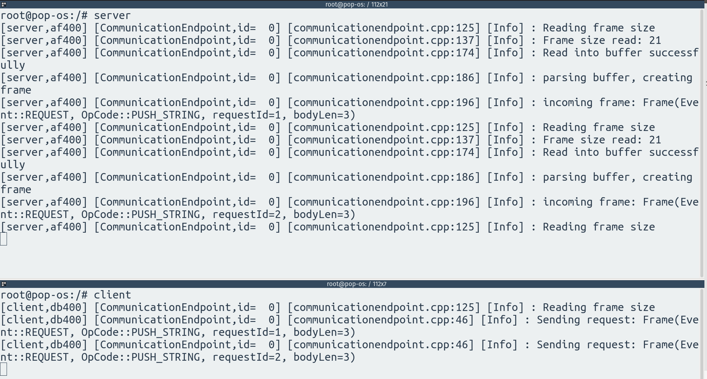

# DistributedSystemsHW

## Progress So Far

* **boost::log**: setup thread-safe logger
* **boost::asio**: simple tcp echo server
* custom tcp protocol definition and tests
* **intel::tbb** concurrent vector for data storage
* basic protocol communication via tcp socket (compose file does not work yet)

